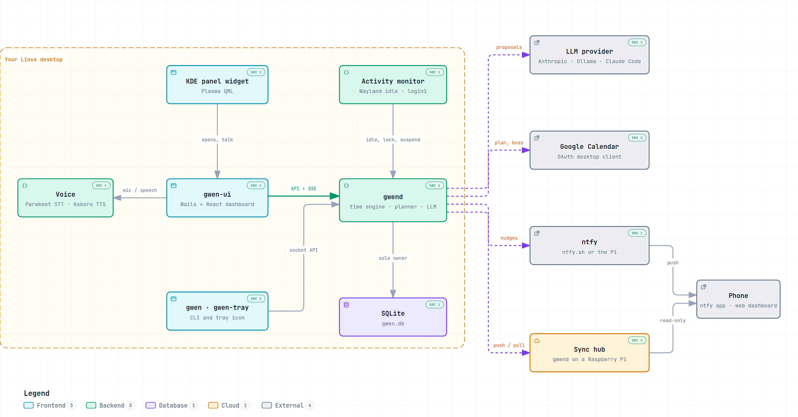
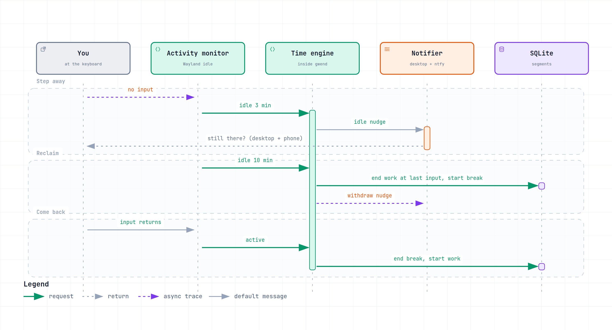

<h1 align="center">Gwen</h1>

<p align="center">
  A personal time tracker, study planner, and AI companion for the Linux desktop.<br>
  She clocks your working day, notices when you walk away, nudges you back on your desktop and phone,
  turns long-term goals into daily plans, and talks it through with you out loud.
</p>

<p align="center">
  
  
  
  
  
</p>

---

## Features

### ⏱️ Tracking that keeps itself honest

- **Clock in once, Gwen does the rest.** Work, breaks, and idle time are split into segments automatically.
- **Notices when you leave.** After 3 minutes with no keyboard or mouse she asks if you're still there; after 10 the
  time since your last input becomes a break. Locking the screen or suspending starts a break at once.
- **Privacy by design.** The only signal read is *input or no input*. Nothing about what you type or which app is
  focused ever leaves the activity monitor.
- **Daily target and rollover.** Set a full day (default `8h`) and when a new day starts, so late nights count
  toward the right day.
- **Fix anything afterwards.** Add, edit, split, or remove segments from History or `gwen seg`.

### 🗓️ Planning

- **Goals → tasks → daily plans.** A deterministic planner turns goals, tasks, and recurring commitments into a
  plan for the day, leaving a buffer free.
- **Google Calendar.** Your plan is written to a calendar of its own, and events on the calendars you choose count
  as busy time the planner works around.
- **Inbox, Board, and Projects.** Capture fast, drag tasks across a board, and group them by project.
- **Weekly review and stats.** A retro of the week from your numbers, plus Stats with a heatmap of your days.

### 💬 Gwen, the assistant

- **Chat and plan with AI.** Break a goal into tasks, plan a day in conversation, or write a weekly retro. The AI
  only *proposes*; you accept or reject every change.
- **Bring your own model.** Anthropic API, any OpenAI-compatible endpoint (Ollama works with no key), or your
  Claude Pro/Max subscription through Claude Code. Or none: everything else works without an LLM.
- **A personality.** Gwen has a voice, 12 moods with animated sprites, and attitudes she picks for herself. Rename
  her and tell her about yourself under **Settings → AI → Personality**.
- **Talk out loud.** Dictate into any chat, or open the talk window from the panel and have a spoken conversation.
  Speech-to-text (NVIDIA Parakeet) and text-to-speech (Kokoro) run **on your machine**; Fish Audio is an optional
  online voice.

### 📱 Everywhere you are

- **Dashboard (`gwen-ui`).** Today, Assistant, Inbox, Board, Plan, Goals, Weekly review, History, Stats, Projects,
  and Settings. Every setup step has a screen, no terminal needed.
- **KDE panel widget.** The timer in your panel; click it for the now card with progress, the next plan block, an
  energy check-in, and Break / Clock out. Other desktops get a tray icon.
- **Phone nudges.** Through the free [ntfy](https://ntfy.sh) app, from ntfy.sh or your own server.
- **Raspberry Pi hub (optional).** Syncs between laptops every 5 minutes and serves a read-only phone dashboard.
  With Tailscale it works from anywhere, with nothing opened to the internet.
- **A full CLI.** `gwen in`, `gwen out`, `gwen status`, `gwen plan`, `gwen stats`, `gwen setup`, and more.

---

## Architecture

<picture>
  <source media="(prefers-color-scheme: dark)" srcset="assets/readme/architecture-dark.png">
  
</picture>

**`gwend`** is the heart: a systemd user service that is the only owner of the database. It runs the activity
monitor, the time engine, the planner, notifications, and the integrations, and serves an HTTP API with live
Server-Sent Events on `$XDG_RUNTIME_DIR/gwen/gwend.sock`. Every client (dashboard, panel widget, tray, CLI) goes
through that socket, so closing the dashboard never stops tracking.

| Piece | What it is | Where |
|---|---|---|
| `gwend` | The daemon: API, time engine, planner, notifier, sync, LLM adapter | [cmd/gwend](cmd/gwend) |
| `gwen-ui` | Wails window over the React dashboard; also hosts voice in and out | [cmd/gwen-ui](cmd/gwen-ui), [ui](ui) |
| `gwen` | The command-line client and setup wizard | [cmd/gwen](cmd/gwen) |
| `gwen-tray` | Tray icon (StatusNotifierItem) for desktops without the panel widget | [cmd/gwen-tray](cmd/gwen-tray) |
| Panel widget | KDE Plasma applet; polls `gwen panel` and opens the dashboard or talk window | [packaging/plasma](packaging/plasma) |
| Time engine | Pure state machine: activity events and commands in, segments out | [internal/timeengine](internal/timeengine) |
| Planner | Pure functions: goals, tasks, and commitments in, a day plan out | [internal/planner](internal/planner) |
| Voice | `pw-record` → Parakeet, Kokoro or Fish → `pw-play`, via sherpa-onnx | [internal/voice](internal/voice) |
| Sync hub | `gwend` in hub mode on an arm64 Pi, plus the laptop-side client | [internal/sync](internal/sync), [packaging/pi](packaging/pi) |

### Stepping away from the desk

<picture>
  <source media="(prefers-color-scheme: dark)" srcset="assets/readme/tracking-dark.png">
  
</picture>

Both diagrams are interactive (zoom, search, trace a path, light/dark, export): open
[architecture.html](assets/readme/architecture.html) or [tracking.html](assets/readme/tracking.html) in a browser.
They're generated with [Archify](https://github.com/tt-a1i/archify) from
[architecture.json](assets/readme/architecture.json) and [tracking.json](assets/readme/tracking.json).

---

## Quick start

```sh
make install-dev            # build everything into bin/ and install to ~/.local/bin
gwen setup                  # wizard: service, tracking, tray, phone
gwen project add Internship
gwen in --project Internship
gwen status
gwen out
```

Then open **Gwen** from the app menu, or run `gwen-ui`. Prefer a package? `make package` builds an rpm and a deb in
`dist/`.

**Requirements:** Linux with a systemd user session, Go 1.26+, Node.js 24, and GTK 3 / WebKitGTK 4.1 headers for the
dashboard. Idle detection works on Wayland (KDE Plasma, GNOME, sway) and falls back to X11.

Everything else (packages, first run, phone push, Google Calendar, the LLM, the Raspberry Pi hub, where files live,
troubleshooting, and uninstalling) is in **[setup.md](setup.md)**. Day-to-day build and run commands are in
[commands.md](commands.md).

## Development

```sh
make build     # bin/gwend, bin/gwen, bin/gwen-tray, bin/gwen-ui (+ voice libraries)
make check     # gofmt, go vet, staticcheck, go test -race, tsc
make package   # rpm + deb in dist/
make build-hub # arm64 gwend for the Raspberry Pi
```

Run the daemon in a terminal with readable logs:

```sh
systemctl --user stop gwend
bin/gwend --foreground
```

## Your data

Everything lives on your machine: the database at `~/.local/share/gwen/gwen.db`, config at
`~/.config/gwen/config.toml`, and secrets in `~/.local/share/gwen/credentials/` (mode `0700`, never in the config).
Data leaves only through integrations you turn on: ntfy for nudges, Google Calendar for your plan, your chosen LLM
provider for AI proposals, Fish Audio if you pick it as Gwen's voice, and your own Pi hub for sync.
